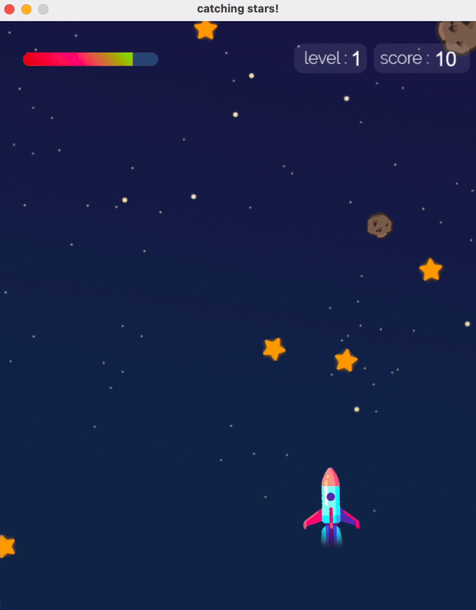

# Catching Stars


This project is a 2nd semester game project (Programming II) of Freshman year's, Software and Knowledge Engineering at Kasetsart University.
> written in Python using the [Arcade](http://arcade.academy/) library.

Main menu             |  Game play
:-------------------------:|:-------------------------:
  |  


* [ version 1.0 | 2019 ]
    - Compatible with Python 3.6, but it's outdated 
* [ version 2.0 | 2024 ] 🆕
    - Fixed broken source code to be compatible with Python 3.7, 3.8, and 3.9.
    - New color for health bar and spaceship

## Requirements
 * Python versions 3.7, 3.8, and 3.9 with Arcade Library 2.6.17
```
pip3 install -r requirements.txt
```

## How to run
run catching-stars.py 

Catching stars is compatible with Python 3.7, 3.8, and 3.9
So you have to use this command
```
python3 catching-stars.py
```
